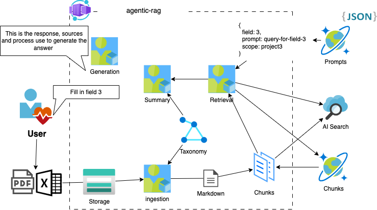

# Multi-Agent: Document reasoning

## Overview



## Quickstart & Infrastructure setup

The following lines of code will connect your Codespace az cli and azd cli to the right Azure subscription:

```
# log in with the provided credentials - OPEN A PRIVATE BROWSER SESSION
az login --use-device-code

# if you need to log into a specific tenant - use the --tenant 00000000-0000-0000-0000-000000000000 parameter
az login --use-device-code --tenant 00000000-0000-0000-0000-000000000000 

# "log into azure dev cli - only once" - OPEN A PRIVATE BROWSER SESSION
azd auth login --use-device-code

# press enter open up https://microsoft.com/devicelogin and enter the code

```

Now deploy the infrastructure components with azure cli

```
azd up
```

Get the values for some env variables
```
azd env get-values | grep AZURE_ENV_NAME
source <(azd env get-values | grep AZURE_ENV_NAME)
```

deploy the project backend in Azure Container Apps. 
```
bash ./azd-hooks/deploy.sh backend $AZURE_ENV_NAME
```

## KernelService


Kernelservice is used here as the ingestion pipeline:
https://github.com/microsoft/kernel-memory


Deploy kernelservice with the following command
```
bash ./azd-hooks/deploy-ks.sh $AZURE_ENV_NAME
```

Ingest documents via the src/ingestion/uploader.py